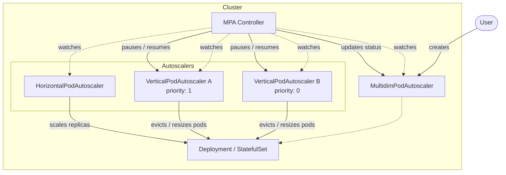

# AEP-5342: Multi-dimensional Pod Autoscaler

AEP - Autoscaler Enhancement Proposal

<!-- toc -->
- [Release Signoff Checklist](#release-signoff-checklist)
- [Summary](#summary)
- [Motivation](#motivation)
  - [Goals](#goals)
  - [Non-Goals](#non-goals)
- [Proposal](#proposal)
  - [User Stories](#user-stories)
    - [A New MPA Framework with Reinforcement Learning](#a-new-mpa-framework-with-reinforcement-learning)
    - [Different Scaling Actions for Different Types of Resources](#different-scaling-actions-for-different-types-of-resources)
- [Design Details](#design-details)
  - [Test Plan](#test-plan)
    - [Unit Tests](#unit-tests)
    - [Integration Tests](#integration-tests)
    - [End-to-end Tests](#end-to-end-tests)
- [Risk and Mitigation](#risk-and-mitigation)
  - [Race: spec.pausedBy set arrives after a pod has already been evicted](#race-specpausedby-set-arrives-after-a-pod-has-already-been-evicted)
  - [Transient mixed-request fleet after HPA scale-out](#transient-mixed-request-fleet-after-hpa-scale-out)
  - [Multiple MPAs targeting the same workload](#multiple-mpas-targeting-the-same-workload)
- [Production Readiness Review Questionnaire](#production-readiness-review-questionnaire)
  - [Feature Enablement and Rollback](#feature-enablement-and-rollback)
  - [Dependencies](#dependencies)
  - [Scalability](#scalability)
  - [Troubleshooting](#troubleshooting)
- [Alternatives](#alternatives)
<!-- /toc -->

## Release Signoff Checklist

Items marked with (R) are required *prior to targeting to a milestone / release*.

- [ ] (R) AEP approvers have approved the AEP status as `implementable`
- [ ] (R) Design details are appropriately documented
- [ ] (R) Test plan is in place, giving consideration to SIG Architecture and SIG Testing input (including test refactors)
  - [ ] e2e Tests for all Beta API Operations (endpoints)
  - [ ] (R) Ensure GA e2e tests meet requirements for [Conformance Tests](https://github.com/kubernetes/community/blob/master/contributors/devel/sig-architecture/conformance-tests.md)
  - [ ] (R) Minimum Two Week Window for GA e2e tests to prove flake free
- [ ] (R) Graduation criteria is in place
  - [ ] (R) [all GA Endpoints](https://github.com/kubernetes/community/pull/1806) must be hit by [Conformance Tests](https://github.com/kubernetes/community/blob/master/contributors/devel/sig-architecture/conformance-tests.md)
- [ ] (R) Production readiness review completed
- [ ] (R) Production readiness review approved
- [ ] "Implementation History" section is up-to-date for milestone
- [ ] User-facing documentation has been created in [kubernetes/website], for publication to [kubernetes.io]
- [ ] Supporting documentation—e.g., additional design documents, links to mailing list discussions/SIG meetings, relevant PRs/issues, release notes

<!--
**Note:** This checklist is iterative and should be reviewed and updated every time this enhancement is being considered for a milestone.
-->

[kubernetes.io]: https://kubernetes.io/
[kubernetes/enhancements]: https://git.k8s.io/enhancements
[kubernetes/kubernetes]: https://git.k8s.io/kubernetes
[kubernetes/website]: https://git.k8s.io/website

## Summary

Currently, Horizontal Pod Autoscaler (HPA) and Vertical Pod Autoscaler (VPA) control the scaling actions separately as independent controllers to determine the resource allocation for a containerized application.
Due to the independence of these two controllers, when they are configured to optimize the same target, e.g., CPU usage, they can lead to an awkward situation where HPA tries to spin more pods based on the higher-than-threshold CPU usage while VPA tries to squeeze the size of each pod based on the lower CPU usage (after scaling out by HPA).
The final outcome would be a large number of small pods created for the workloads.
Manual fine-tuning the timing to do vertical/horizontal scaling and prioritization are usually needed for synchronization of the HPA and VPA.

We propose a Multi-dimensional Pod Autoscaling (MPA) as a thin reactive synchronizer, fully decoupled from both HPA and VPA internals. The MPA API does not replace or wrap either controller. Instead, it considers the temporal relationship between the two scalers — HPA responds to sudden demand within seconds; VPA right-sizes over minutes to hours — and resolves their conflict without coupling MPA to either controller's internals.

The MPA controller uses a newly introduced field `.spec.pausedBy` on the VPA object to pause vertical scaling while HPA is actively scaling. When `spec.pausedBy` is set, the VPA must be paused; when it is nil, actuation proceeds normally. This pause is gated by the `MultidimPodAutoscaler` feature gate. No other VPA internal logic changes.

> [!NOTE]
> The original AEP-5342 ([implemented in PR`#7550`](https://github.com/kubernetes/autoscaler/pull/7550)) built a monolithic Multi-dimensional Pod Autoscaler that subsumed HPA and VPA logic into a single controller. As discussed in [issue `#8493`](https://github.com/kubernetes/autoscaler/issues/8493#issuecomment-3246027731), the fundamental concern is long-term maintainability: any internal change to HPA or VPA must be tracked and replicated inside MPA, creating permanent coupling.

## Motivation

To scale application Deployments, Kubernetes supports both horizontal and vertical scaling with a Horizontal Pod Autoscaler (HPA) and a Vertical Pod Autoscaler (VPA), respectively.
Currently, [HPA] and [VPA] work separately as independent controllers to determine the resource allocation of a containerized application.
- HPA determines the number of replicas for each Deployment of an application with the aim of automatically scaling the workload to match demand. The HPA controller, running within the Kubernetes control plane, periodically adjusts the desired scale of its target (e.g., a Deployment) to match observed metrics such as average CPU utilization, average memory utilization, or any other custom metric the users specify (e.g., the rate of client requests per second or I/O writes per second). The autoscaling algorithm that the HPA controller uses is based on the equation `desired_replicas = current_replicas * (current_metric_value / desired_metric_value)`.
- VPA determines the size of containers, namely CPU and Memory Request and Limit. The primary goal of VPA is to reduce maintenance costs and improve the utilization of cluster resources. When configured, it will set the Request and Limit automatically based on historical usage and thus allow proper scheduling onto nodes so that the appropriate resource amount is available for each replica. It will also maintain ratios between limits and requests that were specified in the initial container configuration.

When using HPA and VPA together to both reduce resource usage and guarantee application performance, VPA resizes pods based on their measured resource usage, and HPA scales in/out based on the customer application performance metric, and their logic is entirely ignorant of each other.
Due to the independence of these two controllers, they can lead to an awkward situation where VPA tries to squeeze the pods into smaller sizes based on their measured utilization.
Still, HPA tries to scale out the applications to improve the customized performance metrics.
It is also [not recommended] to use HPA together with VPA for CPU or memory metrics.
Therefore, there is a need to combine the two controllers so that horizontal and vertical scaling decisions are made in combination for an application to achieve both objectives, including resource efficiency and the application service-level objectives (SLOs)/performance goals.
However, existing VPA/HPA designs cannot accommodate such requirements.
Manual fine-tuning the timing or frequency to do vertical/horizontal scaling and prioritization are usually needed for synchronization of the HPA and VPA.

HPA and VPA operate on fundamentally different time horizons, as observed by the KEDA community in [kedacore/keda#1788](https://github.com/kedacore/keda/issues/1788#issuecomment-1025831724):

> *"VPA is meant for long-term scaling — it watches historical resource usage over time and adjusts pod sizes for efficiency. HPA is meant for sudden increases in load — it reacts to real-time metrics and scales out replicas within seconds."*

This temporal difference is the root cause of their conflict:

1. **During a traffic burst**, HPA detects high CPU utilization and begins scaling out replicas. At the same moment, VPA may be mid-eviction, applying a resource recommendation computed from a quiet period. This eviction *reduces* available capacity precisely when more capacity is needed, worsening latency and potentially triggering pod disruption budget violations.

2. **After a scale-out**, the per-pod CPU drops because the load is now shared across more replicas. VPA observes this lower utilization and recommends smaller resource requests. HPA then sees that utilization is rising again (because the ceiling is lower) and scales out further. The result is the classic oscillation: many small pods.

3. **During a scale-in**, HPA is terminating replicas. If VPA simultaneously evicts a pod for resizing, the workload can briefly drop below its minimum healthy replica count.

[HPA]: https://kubernetes.io/docs/tasks/run-application/horizontal-pod-autoscale/
[VPA]: https://github.com/kubernetes/autoscaler/tree/master/vertical-pod-autoscaler
[not recommended]: https://cloud.google.com/kubernetes-engine/docs/concepts/horizontalpodautoscaler

### Goals

- Design and implement a holistic framework to achieve multi-dimensional pod autoscaling (MPA).
- Structurally prevent HPA and VPA from conflicting on the same workload.
- Introduce a `MultidimPodAutoscaler` CRD that owns the coordination state.
- Handle multiple autoscalers (including multiple VPAs) on the same workload.

### Non-Goals

- Designing a new combined scaling algorithm.
- Replacing or extending HPA or VPA recommendation logic.

### User Stories

#### A New MPA Framework with Reinforcement Learning

Many studies in research show that combined horizontal and vertical scaling can guarantee application performance with better resource efficiency using advanced algorithms such as reinforcement learning [1, 2]. These algorithms cannot be used with existing HPA and VPA frameworks. A new framework (MPA) is needed to combine horizontal and vertical scaling actions and separate the actuation of scaling actions from the autoscaling algorithms. The new MPA framework will work for all workloads on Kubernetes.

[1] Haoran Qiu, Subho S. Banerjee, Saurabh Jha, Zbigniew T. Kalbarczyk, Ravishankar K. Iyer (2020). FIRM: An Intelligent Fine-Grained Resource Management Framework for SLO-Oriented Microservices. In Proceedings of the 14th USENIX Symposium on Operating Systems Design and Implementation (OSDI 2020).

[2] Haoran Qiu, Weichao Mao, Archit Patke, Chen Wang, Hubertus Franke, Zbigniew T. Kalbarczyk, Tamer Başar, Ravishankar K. Iyer (2022). SIMPPO: A Scalable and Incremental Online Learning Framework for Serverless Resource Management. In Proceedings of the 13th ACM Symposium on Cloud Computing (SoCC 2022).

#### Different Scaling Actions for Different Types of Resources

For certain workloads, to ensure a custom metric (e.g., throughput or request-serving latency), horizontal scaling typically controls the CPU resources effectively, and vertical scaling is typically effective in increasing or decreasing the allocated memory capacity per pod. Thus, there is a need to control different types of resources at the same time using different scaling actions. Existing VPA and HPA can control these separately. However, they cannot achieve the same objective, e.g., guarantee a custom metric within an SLO target, by controlling both dimensions with different resource types independently. For example, they can lead to an awkward situation where HPA tries to spin more pods based on the higher-than-threshold CPU usage while VPA tries to squeeze the size of each pod based on the lower memory usage (after scaling out by HPA). In the end, there will be a large number of small pods created for the workloads.

---

## Proposal

This enhancement introduces a new `MultidimPodAutoscaler` autoscaling API that coordinates multiple autoscaler objects targeting the same workload.

The MPA controller auto-discovers all `VerticalPodAutoscaler` (VPA) and `HorizontalPodAutoscaler` (HPA) objects in the same namespace whose target reference matches `spec.targetRef`. It **always prioritizes HPA over VPA**: whenever any HPA is actively scaling (`currentReplicas != desiredReplicas`), all discovered VPAs are paused by setting `spec.pausedBy` to a reference pointing to the managing MPA object. MPA never modifies HPA.

When all HPAs are stable, VPA actuation resumes after `spec.stableDurationSeconds` to allow the fleet to settle before VPA begins evicting or resizing pods. When multiple VPAs target the same workload, only one VPA holds the active token at a time; it is re-evaluated after `spec.tokenHoldDurationSeconds` to allow other VPAs a turn. These two fields are the only tuning surface exposed by the MPA spec.

## Design Details

### Architecture Overview



MPA is decoupled from both controllers:

- All coordination state (active autoscaler, last transition time, discovered scalers) lives in the `MultidimPodAutoscaler` CR status.
- It **watches** HPA status (`currentReplicas`, `desiredReplicas`) to determine whether any HPA is in-progress.
- It **watches** VPA for prority and condition status to determine readiness and priority of each VPA.
- It **pause or resume** VPA via its `spec.pausedBy` (set to an `MPARef` when pausing; cleared to nil when resuming).

#### MultidimPodAutoscaler API

```go
// MultidimPodAutoscaler coordinates all HPAs and VPAs that target the same
// workload. The user declares intent via spec.targetRef; the controller
// discovers the actual scalers and records them in status.
type MultidimPodAutoscaler struct {
    metav1.TypeMeta   `json:",inline"`
    metav1.ObjectMeta `json:"metadata,omitempty"`

    Spec   MultidimPodAutoscalerSpec   `json:"spec"`
    Status MultidimPodAutoscalerStatus `json:"status,omitempty"`
}

type MultidimPodAutoscalerSpec struct {
    // TargetRef points to the workload being scaled.
    // The controller uses this to discover all HPAs and VPAs in the same
    // namespace whose scaleTargetRef / targetRef matches this reference.
    TargetRef autoscalingv1.CrossVersionObjectReference `json:"targetRef"`

    // StableDurationSeconds is the minimum number of seconds all HPAs must
    // have been stable (currentReplicas == desiredReplicas) before the
    // controller allows a VPA to become active. This prevents VPA from
    // resuming evictions while the fleet is still settling after a scale event.
    // Defaults to 60.
    // +optional
    StableDurationSeconds *int32 `json:"stableDurationSeconds,omitempty"`

    // TokenHoldDurationSeconds is the maximum number of seconds a single VPA
    // may remain the active autoscaler before the controller re-evaluates
    // which VPA should hold the token. This prevents a high-priority VPA from
    // monopolising actuation indefinitely when multiple VPAs target the same
    // workload. After the token expires the controller re-selects the
    // highest-priority VPA; if the winner is unchanged the token is simply
    // renewed. Defaults to 600.
    // +optional
    TokenHoldDurationSeconds *int32 `json:"tokenHoldDurationSeconds,omitempty"`
}

type MultidimPodAutoscalerStatus struct {
    // ActiveAutoscaler is the name and type of the scaler currently allowed
    // to act. Nil when no scaler is active (e.g., between an HPA stabilizing
    // and VPA resuming after stableDurationSeconds).
    // +optional
    ActiveAutoscaler *AutoScalerRef `json:"activeAutoscaler,omitempty"`

    // LastTransitionTime is the last time the active autoscaler changed.
    // +optional
    LastTransitionTime *metav1.Time `json:"lastTransitionTime,omitempty"`

    // AutoScalers lists the HorizontalPodAutoscalers and VerticalPodAutoscalers
    // discovered by the controller as co-targeting the same workload as this
    // MPA. Updated on every reconcile.
    // +optional
    // +listType=map
    // +listMapKey=name
    AutoScalers []AutoScalerRef `json:"autoscalers,omitempty"`

    // Conditions describes the current state of the MultidimPodAutoscaler.
    // +optional
    // +patchMergeKey=type
    // +patchStrategy=merge
    Conditions []metav1.Condition `json:"conditions,omitempty"`
}

// ScalerType identifies the kind of autoscaler referenced by an AutoScalerRef.
// +enum
type ScalerType string

const (
    // HorizontalPodAutoscalerScalerType indicates the referenced scaler is a
    // HorizontalPodAutoscaler.
    HorizontalPodAutoscalerScalerType ScalerType = "HorizontalPodAutoscaler"

    // VerticalPodAutoscalerScalerType indicates the referenced scaler is a
    // VerticalPodAutoscaler.
    VerticalPodAutoscalerScalerType ScalerType = "VerticalPodAutoscaler"
)

// AutoScalerRef identifies a single HPA or VPA object tracked by the MPA.
type AutoScalerRef struct {
    // Name is the name of the HPA or VPA object.
    Name string `json:"name"`

    // ScalerType is the kind of the referenced scaler.
    // +kubebuilder:validation:Enum=HorizontalPodAutoscaler;VerticalPodAutoscaler
    ScalerType ScalerType `json:"scalerType"`

    // InProgress indicates whether this scaler is currently active.
    // For HPA: true when desiredReplicas != currentReplicas.
    // For VPA: true when a recommendation has been provided (RecommendationProvided condition).
    InProgress bool `json:"inProgress"`
}
```

### API Changes

#### VPA API: `spec.pausedBy` field

A structured reference field `PausedBy` is added to `VerticalPodAutoscalerSpec`. Presence of this field signals that actuation must be suspended; absence means the VPA runs freely. Using an object reference rather than a bare boolean makes the pause self-documenting (who set it and why) and avoids the ambiguity of a boolean with no ownership semantics.

```go
// PausedBy, when set, suspends VPA actuation (updater evictions and admission
// controller resource injection) without stopping the recommender. The field
// identifies the controller that owns the pause. A nil value means the VPA is
// not paused. Managed by MultidimPodAutoscaler when the MultidimPodAutoscaler
// feature gate is enabled. Do not set manually when an MPA is present.
// +optional
PausedBy *MPARef `json:"pausedBy,omitempty"`

// MPARef is a reference to the MultidimPodAutoscaler object that has paused
// this VPA. It carries enough information to identify the owner unambiguously
// and to emit informative log / event messages.
type MPARef struct {
    // Name is the name of the MultidimPodAutoscaler object.
    Name string `json:"name"`

    // Namespace is the namespace of the MultidimPodAutoscaler object.
    // Must equal the namespace of the VPA — included for diagnostic clarity.
    Namespace string `json:"namespace"`

    // UID is the UID of the MultidimPodAutoscaler object. Used to detect
    // stale references left by a deleted-and-recreated MPA.
    // +optional
    UID types.UID `json:"uid,omitempty"`
}
```

### MPA Controller Loop

1. **MPA create event.** The controller lists all HPAs and VPAs in `mpa.Namespace` whose `scaleTargetRef` / `targetRef` matches `spec.targetRef`. It writes the discovered names into `status.autoscalers` and registers the new MPA with the HPA/VPA watcher. If no scalers are found, the controller updates status and returns — nothing to coordinate.

    This design reflects the real ownership boundary:
    - The user declares *intent* — "coordinate autoscalers for this workload" — via `spec.targetRef`.
    - The controller observes *which scalers exist* and records them in status.
    - See [issue #10158](https://github.com/kubernetes/autoscaler/issues/10158) for the multi-VPA motivation.

2. **HPA/VPA watch events.** The HPA/VPA watcher observes Create, Update, and Delete events on all HPA and VPA objects whose `scaleTargetRef` matches a registered MPA. A newly discovered scaler is added to `status.autoscalers`. A deleted or unbound scaler is removed. Status is updated to reflect the current observed state on each event.

3. **Active autoscaler decision.** On each reconcile, the controller evaluates `status.activeAutoscaler`:

    - If `status.activeAutoscaler` is nil:
      - If any HPA is scaling (`hpa.status.currentReplicas != hpa.status.desiredReplicas`), set that HPA as the active autoscaler.
      - If `spec.stableDurationSeconds` has elapsed since `status.lastTransitionTime`, select the highest-priority VPA (lowest `priority` number; tie-break: earliest `lastTransitionTime`) as the active autoscaler and unpause it.
      - Otherwise, do nothing (fleet is in the post-HPA settling window).
    - If `status.activeAutoscaler` is an HPA:
      - If that HPA has become stable (`currentReplicas == desiredReplicas`), reset `activeAutoscaler` to nil and record `status.lastTransitionTime` to start the `stableDurationSeconds` timer.
      - Otherwise, do nothing.
    - If `status.activeAutoscaler` is a VPA:
      - If `spec.tokenHoldDurationSeconds` has not yet elapsed since `status.lastTransitionTime`, do nothing (current VPA retains the token).
      - Otherwise, re-select the highest-priority VPA; if the winner differs from the current holder, update `activeAutoscaler` and record `status.lastTransitionTime`.

    Update `status.lastTransitionTime` whenever `status.activeAutoscaler` changes.

4. **Pause enforcement.** All VPAs that are not the active autoscaler are paused by setting `spec.pausedBy` to an `MPARef` pointing to the managing MPA. When the active autoscaler is an HPA or nil-with-delay, all VPAs are paused. When a VPA becomes the active autoscaler, `spec.pausedBy` is cleared to nil.

### VPA `spec.pausedBy` Field

A new reference field `PausedBy *MPARef` is added to `VerticalPodAutoscalerSpec` (top-level). There is no equivalent field in the Kubernetes HPA API — this field is introduced specifically for MPA coordination and has no direct counterpart in the HPA type.

The semantics are deliberately **presence-based**: a non-nil `spec.pausedBy` means "this VPA is paused"; a nil value means "this VPA runs freely". This avoids the boolean anti-pattern where `false` is indistinguishable from "not yet set" and carries no ownership information.

```go
// VerticalPodAutoscalerSpec is the specification of the behavior of the autoscaler.
type VerticalPodAutoscalerSpec struct {
    TargetRef    *autoscalingv1.CrossVersionObjectReference `json:"targetRef"`
    UpdatePolicy *PodUpdatePolicy                          `json:"updatePolicy,omitempty"`
    ResourcePolicy *PodResourcePolicy                      `json:"resourcePolicy,omitempty"`
    Recommenders []*VerticalPodAutoscalerRecommenderSelector `json:"recommenders,omitempty"`
    StartupBoost *StartupBoost                             `json:"startupBoost,omitempty"`

    // PausedBy, when non-nil, suspends VPA actuation (updater evictions and
    // admission controller resource injection) without stopping the recommender.
    // The recommender continues accumulating metrics and updating recommendations,
    // but no pods are evicted or resized.
    //
    // The value identifies the MultidimPodAutoscaler that owns the pause.
    // This field MUST NOT be set manually when an MPA is managing this VPA —
    // use the MPA object instead.
    //
    // Only effective when the MultidimPodAutoscaler feature gate is enabled.
    // +optional
    PausedBy *MPARef `json:"pausedBy,omitempty"`
}
```

**How VPA components respect `spec.pausedBy`** (gated by `features.Enabled(features.MultidimPodAutoscaler)`):

- **Updater** ([`updater.go:199`](pkg/updater/logic/updater.go)): adds a `spec.pausedBy` check immediately after the existing `updateMode` filter. A paused VPA is skipped for the entire loop iteration — no evictions, no in-place resizes.

  ```go
  // After existing updateMode filter:
  if features.Enabled(features.MultidimPodAutoscaler) && vpa.Spec.PausedBy != nil {
      klog.V(3).InfoS("Skipping VPA object because it is paused by MPA",
          "vpa", klog.KObj(vpa), "pausedBy", vpa.Spec.PausedBy.Name)
      continue
  }
  ```

- **Admission controller** ([`matcher.go:78`](pkg/admission-controller/resource/vpa/matcher.go)): adds a `spec.pausedBy` check alongside the existing `UpdateModeOff` skip.

  ```go
  if features.Enabled(features.MultidimPodAutoscaler) && vpaConfig.Spec.PausedBy != nil {
      continue
  }
  ```

- **Recommender**: no change. The recommender does not check `spec.pausedBy`. It continues building the historical model regardless of pause state, ensuring the VPA has a fresh recommendation ready the moment actuation resumes.

- On deletion of the `MultidimPodAutoscaler`, a finalizer ensures `spec.pausedBy` is set back to `nil` before the MPA object is garbage-collected. Because the field carries the MPA's UID, a VPA whose `spec.pausedBy.uid` does not match any live MPA is treated as stale and automatically cleared by the controller on the next reconcile.

> **Extended resource coverage** — because `spec.pausedBy` gates the VPA updater and admission controller at their entry points, the pause applies uniformly to *all* resource dimensions the VPA manages: CPU, memory, and extended resources backed by Dynamic Resource Allocation. In the [`UpdateModeDRARecreate` mode](https://github.com/sunya-ch/k8s-autoscaler/tree/dra-autoscaler/vertical-pod-autoscaler/enhancements/NNNN-dra-recreate) (WIP), VPA patches `ResourceClaim` capacity at pod-creation time via the admission controller. When `spec.pausedBy` is non-nil, that ResourceClaim patch is also suppressed.

## Risk and Mitigation

### Race: `spec.pausedBy` set arrives after a pod has already been evicted

There is a window between the VPA updater deciding to evict a pod and the `spec.pausedBy` patch being reflected in the updater's in-memory snapshot. If the patch lands while the updater is mid-loop and a pod has already been selected for eviction, that eviction will complete. If the admission controller cache is also stale at the moment the replacement pod is admitted, the VPA recommendation will be applied to the new pod — both outcomes are safe.

For in-place mode (`UpdateModeInPlace` or `UpdateModeInPlaceOrRecreate`), no pod is deleted; the resize is applied by patching the pod's `/resize` subresource and negotiated by the kubelet. A pause arriving mid-resize leaves the pod running at the VPA-recommended values, which is acceptable.

**Mitigation:** HPA does not report `desiredReplicas != currentReplicas` instantaneously — there is typically a 15–30 second stabilization window before HPA issues a scale. The MPA synchronizer sets `spec.pausedBy` before HPA begins creating new pods, giving the VPA updater's current loop time to complete. Keeping vertical steps small further limits transient resource divergence across pods. To monitor the state, check `VPA.status.conditions` (eviction) and `pod.status.resize` (in-place resize) on pods whose VPA has a non-nil `spec.pausedBy`.

### Transient mixed-request fleet after HPA scale-out

When VPA has right-sized some pods and HPA then scales out, new pods start at the pod template's original resource requests because a non-nil `spec.pausedBy` prevents the admission controller from applying the VPA recommendation. This creates a fleet with heterogeneous resource requests, which can skew the HPA utilization denominator and trigger a spurious extra scale step.

**Why this is bounded and acceptable:**

1. **Window is short.** Once HPA stabilizes, MPA resumes VPA after `stableDurationSeconds`. VPA then evicts the over-provisioned pods one by one (subject to PDB), resolving the mixed state within one eviction cycle (~minutes). HPA's built-in stabilization (scale-up cooldown, ±10% tolerance band) suppresses most spurious decisions during this window.

2. **Over-provisioning is the correct bias during a burst.** Larger resource requests make `currentUtilization` appear lower, biasing HPA toward scale-out rather than scale-in — which is the right behavior under load.

3. **The alternative is worse.** Leaving `spec.pausedBy=nil` so the admission controller patches new pods during an HPA scale-out re-introduces the concurrent VPA-eviction / HPA-scaling conflict that MPA exists to prevent.

**Mitigation:** watch `kube_pod_container_resource_requests` grouped by workload — a non-zero spread between `min` and `max` requests indicates the fleet is mixed.

### Multiple MPAs targeting the same workload

Nothing in the API prevents a user from creating two or more `MultidimPodAutoscaler` objects in the same namespace with identical `spec.targetRef` values. Each MPA controller instance runs an independent reconcile loop and has no awareness of sibling MPA objects. If two MPA objects co-target the same workload, they will race to pause and unpause the same VPAs on every reconcile cycle.

**Why this is a problem:**

- Each MPA evaluates its own `status.activeAutoscaler` and `status.lastTransitionTime` independently. One MPA may decide a VPA should be active (unpaused), while the other simultaneously decides it should be paused. The last writer wins on each API server round-trip, producing non-deterministic VPA pause state.
- `spec.pausedBy` is owned by whichever MPA most recently completed its patch. Server-Side Apply field ownership is per-manager, so both managers can own the same field and overwrite each other without conflict detection.
- The `tokenHoldDuration` token-rotation logic is meaningless under two competing state machines: neither MPA's timer reflects actual unpaused time for the VPA.

**Mitigation — detection:**

The MPA controller checks on each reconcile whether any other `MultidimPodAutoscaler` object in the same namespace shares its `spec.targetRef`. If a conflict is detected:

1. The controller sets a `Degraded=True` status condition on the object with reason `ConflictingMPA` and a message listing the conflicting object names.
2. No `spec.pausedBy` patches are issued while the condition is set — the controller backs off entirely to avoid making the race worse.
3. The conflict is logged at warning level and surfaced via the `mpa_conflicting_target_total` Prometheus counter (labels: `namespace`, `target_kind`, `target_name`).

The condition clears automatically once the conflict is resolved (the other MPA is deleted or its `spec.targetRef` is changed).

**Mitigation — prevention:**

A validating admission webhook (part of the MPA admission controller) rejects `CREATE` and `UPDATE` operations on `MultidimPodAutoscaler` objects when another MPA in the same namespace already references the same `spec.targetRef`. The webhook returns a descriptive error message identifying the conflicting object, so operators can resolve the issue before the object is persisted. This makes the conflict a hard error at admission time rather than a silent runtime misbehaviour.

> **Operator guidance:** use one `MultidimPodAutoscaler` per workload. If different teams need to observe or tune the same workload's autoscaling, they should coordinate through a shared MPA object rather than creating independent ones.

### Test Plan

[ ] I/we understand the owners of the involved components may require updates to existing tests to make this code solid enough prior to committing the changes necessary to implement this enhancement.

#### Unit Tests

- VPA updater and admission controller skip a VPA whose `spec.pausedBy` is non-nil when the feature gate is enabled; neither skips it when the gate is disabled.
- MPA pauses all VPAs (sets `spec.pausedBy`) when any HPA is scaling (`currentReplicas != desiredReplicas`), clears `spec.pausedBy` after `stableDurationSeconds`, and issues no patch when the state is already correct (idempotency).
- `tokenHoldDurationSeconds` triggers VPA token re-evaluation; token is renewed without patching `spec.pausedBy` when the winner is unchanged.
- MPA deletion clears `spec.pausedBy` on all managed VPAs via finalizer.
- `desiredReplicas=0` (HPA not yet evaluated) and missing HPA/VPA refs do not crash the controller and do not modify unrelated VPA objects.

#### Integration Tests

- Create a `MultidimPodAutoscaler`; set HPA `desiredReplicas > currentReplicas`; verify `vpa.spec.pausedBy` is set (pointing to the MPA) within one reconcile interval.
- Simulate HPA convergence; verify `vpa.spec.pausedBy` is cleared (set to nil) after `stableDurationSeconds`.
- With two VPAs, verify token rotates to the second VPA after `tokenHoldDurationSeconds` elapses.
- Delete the `MultidimPodAutoscaler`; verify `vpa.spec.pausedBy` is cleared and finalizer is removed.
- Verify no patch is issued when `vpa.spec.pausedBy` is already in the correct state (no spurious writes).
- Verify `vpa.spec.updatePolicy.updateMode` is never modified by MPA under any scenario.
- Create two `MultidimPodAutoscaler` objects with the same `spec.targetRef`; verify the admission webhook rejects the second object. Bypass the webhook and verify both objects enter `Degraded=True / ConflictingMPA` and that no `vpa.spec.pausedBy` patches are issued while the conflict persists. Delete one MPA and verify the remaining MPA clears its `Degraded` condition and resumes normal operation.

#### End-to-End Tests

- Deploy a workload with HPA (CPU) and VPA (CPU + memory). Without `MultidimPodAutoscaler`, trigger a scale-out and observe VPA evictions disrupting it. With `MultidimPodAutoscaler`, repeat the same scale-out and confirm VPA does not evict any pods during the event.
- Confirm `MultidimPodAutoscaler` status conditions reflect cluster state accurately across both phases.
- Confirm deletion of `MultidimPodAutoscaler` leaves both HPA and VPA fully operational (VPA resumes actuation).

### Feature Enablement and Rollback

- **Enabled:** the MPA Controller starts, watches `MultidimPodAutoscaler` objects, and manages `vpa.spec.pausedBy`. The VPA updater and admission controller begin checking `spec.pausedBy`.
- **Disabled after being enabled:** the MPA Controller stops. Any VPA with a non-nil `spec.pausedBy` set by MPA retains that value. The VPA updater and admission controller **ignore** the field (gate is off) and resume actuation automatically — no manual cleanup required. However, the field remains set in the object until the MPA finalizer runs or the operator clears it manually.

Rollback is safe: clearing `spec.pausedBy` (or ignoring it when the gate is off) has no side effects on running pods.

### Graduation Criteria

**Alpha:**
- `MultidimPodAutoscaler` CRD available under the `MultidimPodAutoscaler` feature gate.
- `vpa.spec.pausedBy` field added; VPA updater and admission controller check it under the feature gate.
- Reactive synchronizer loop implemented and unit-tested.
- Finalizer cleanup on MPA deletion implemented.
- Integration tests pass.

**Beta:**
- E2E tests demonstrate that VPA evictions do not occur during HPA scale-outs.
- `stableDurationSeconds` and `tokenHoldDurationSeconds` validated with production workloads.
- Leader election for the synchronizer controller.
- Prometheus metrics: `mpa_phase_transitions_total`, `mpa_vpa_paused_seconds`.

**GA:**
- No open P1/P2 bugs for 2+ releases.
- E2E tests are flake-free.
- Documentation published on kubernetes.io.

### Version Skew

The MPA Controller is a standalone binary. It only writes `vpa.spec.pausedBy` on `VerticalPodAutoscaler` objects and reads `autoscaling/v2` HPA status. It does not interact with the VPA recommender, updater, or admission controller directly. Version skew between VPA components has no effect on the synchronizer — the `spec.pausedBy` field is part of the persisted API object.

### Kubernetes Version Compatibility

No minimum Kubernetes version beyond what VPA already requires. The synchronizer reads only `autoscaling/v2` HPA status fields (`currentReplicas`, `desiredReplicas`), which have been stable since Kubernetes 1.23.

---

## Implementation History

- 2024-08-20: initial reproposal — decoupled synchronizer model with configurable alternating priority
- 2025-07-XX: revised to HPA-priority reactive model; removed configurable priority and initial phase; replaced `updateMode=Off` mechanism with new `vpa.spec.pausedBy` reference field (replaces bare boolean `spec.paused`); introduced `stableDurationSeconds` (post-HPA settling delay before VPA resumes) and `tokenHoldDurationSeconds` (maximum time a single VPA holds the active token before re-evaluation); confirmed full decoupling — MPA never reads VPA internals, only writes one field; noted that coordination guarantee extends to DRA extended resources via `UpdateModeDRARecreate` ([NNNN-dra-recreate](https://github.com/sunya-ch/k8s-autoscaler/tree/dra-autoscaler/vertical-pod-autoscaler/enhancements/NNNN-dra-recreate))

---

## Alternatives

### Original AEP-5342 (PR #7550): Monolithic MPA Controller

[PR #7550](https://github.com/kubernetes/autoscaler/pull/7550) implemented the original AEP-5342 as a full new controller internalizing HPA and VPA logic. The primary concern raised in [issue #8493](https://github.com/kubernetes/autoscaler/issues/8493#issuecomment-3246027731) is long-term maintainability: any change to upstream HPA or VPA must be tracked and replicated inside MPA, creating permanent coupling. It also forces operators to migrate their existing HPA/VPA objects to `MultidimPodAutoscaler` objects. The reactive synchronizer avoids both problems.

### Google GKE Approach: MPA Translated to HPA+VPA Objects

GKE's closed-source `MultidimPodAutoscaler` translates one MPA object into separate HPA and VPA objects and lets them run concurrently. Oscillation prevention is left to the operator through careful metric selection — it is not structural. The synchronizer solves the conflict regardless of metric configuration.

### Configurable Priority / Alternating Token Model

This alternative describes a coordination model that does **not** assume HPA is always the higher-priority scaler. Instead, an MPA object holds a single exclusive token that it grants to exactly one scaler at a time, cycling through phases based on configurable rules.

**Why this is appealing:**

For workloads where VPA has genuine operational urgency (e.g., a memory-constrained batch job that must right-size before the next run), unconditional HPA priority is wrong. The alternating model gives each scaler a guaranteed window and allows the operator to express workload-specific priority explicitly.

**Why this approach was not adopted:**

The fundamental problem is that it requires **both scalers to agree on the same coordination protocol**. Specifically:

1. **VPA `spec.pausedBy` requires VPA-side support gated by the `MultidimPodAutoscaler` feature gate.** If the VPA is at a version that predates the feature gate, `spec.pausedBy` is written to the VPA object but silently ignored — VPA continues acting as if it holds the token even when it doesn't. The token is broken.

2. **Pausing HPA has no clean API primitive.** Unlike VPA (where `spec.pausedBy` is new and purpose-built), there is no equivalent `hpa.spec.pausedBy` field in the Kubernetes API. Pausing HPA in the alternating model would require either freezing replicas (`minReplicas = maxReplicas = currentReplicas`) — a destructive mutation of user-owned fields — or waiting for a future Kubernetes API addition. Either way, the symmetry assumption breaks down immediately.

3. **Version skew is not recoverable without operator intervention.** In the HPA-priority reactive model, version skew between MPA and VPA is limited to the `spec.pausedBy` field: if VPA doesn't check it, VPA simply runs freely — which is exactly what it did before MPA existed. The worst case is **the absence of protection**, not incorrect behavior. In the alternating model, version skew can cause **both scalers to believe they hold the token simultaneously** — which is worse than having no MPA at all.

4. **Timer-based transitions introduce failure modes independent of version skew.** A settling timer can fire before the scaler has genuinely converged, opening a window where both scalers briefly act. The HPA status field (`currentReplicas == desiredReplicas`) is ground truth; a timer is an approximation.

5. **Operator burden without proportional benefit.** For the vast majority of HPA + VPA workloads, the natural priority is clear: HPA handles burst, VPA handles right-sizing. Requiring the operator to configure `vpaActiveSeconds`, `settlingWindowSeconds`, and `priority` per workload adds surface area that can be misconfigured. The reactive model is correct by default.

**In summary:** the alternating token model is technically coherent but requires a negotiated, version-matched contract between the MPA controller and both scaling controllers. The HPA-priority reactive model avoids this entirely — it requires agreement only from VPA (one side, one new field), and degrades safely when that agreement is absent.

### Patching `updateMode=Off` Instead of `spec.pausedBy`

The simplest possible implementation would set `vpa.spec.updatePolicy.updateMode=Off` to suspend the VPA — this already causes the updater and admission controller to skip the VPA with zero new code in those components.

This was rejected because:

1. **Mutates user intent.** The user sets `updateMode` to express how they want VPA to operate (`Auto`, `Recreate`, `InPlace`, etc.). MPA overwriting this field is semantically incorrect and surprising.
2. **Requires save/restore.** The original `updateMode` value must be saved (e.g., in an annotation) and restored exactly. This introduces failure modes: if the annotation is lost, the VPA is permanently stuck in `Off` mode.
3. **No clear ownership.** There is no mechanism to prevent a user from changing `updateMode` while MPA is managing it, or from MPA overwriting a user's deliberate `Off` mode.

The `spec.pausedBy` reference field has none of these problems: it is independent of `updateMode`, has no value to save/restore, is exclusively managed by MPA via field ownership, and its presence unambiguously signals both the pause state and the owning controller.

### VPA Status Condition Instead of `spec.pausedBy`

An alternative approach would use a VPA **status condition** (e.g., `MpaPauseRequested=True`) written by the MPA controller, with the VPA updater and admission controller polling that condition to determine whether to act.

This was rejected because:

1. **Status is not authoritative input.** The Kubernetes convention is that `status` reflects observed state written by the owning controller; it is not an input consumed by that same controller. Writing into `status` to influence behaviour creates an inverted ownership model that is confusing and error-prone.
2. **No server-side apply semantics.** `spec` fields support field ownership via Server-Side Apply, allowing MPA to own exactly the `pausedBy` field without touching anything else. Status conditions lack equivalent ownership primitives — two writers can conflict without a clear conflict-resolution path.
3. **More code, no benefit.** The VPA updater and admission controller would still need to be modified to check the condition, just as they check `spec.pausedBy`. Using `spec.pausedBy` requires the same modifications with cleaner semantics.

### Lease-Only Locking Without MPA Object

Using a Kubernetes `Lease` as a distributed lock acquired by both the HPA and VPA controllers requires upstream changes to both — `kubernetes/kubernetes` for HPA and `kubernetes/autoscaler` for VPA — with no guarantee of acceptance. The `MultidimPodAutoscaler` CRD approach requires zero changes to HPA and only minimal, well-scoped changes to VPA.
